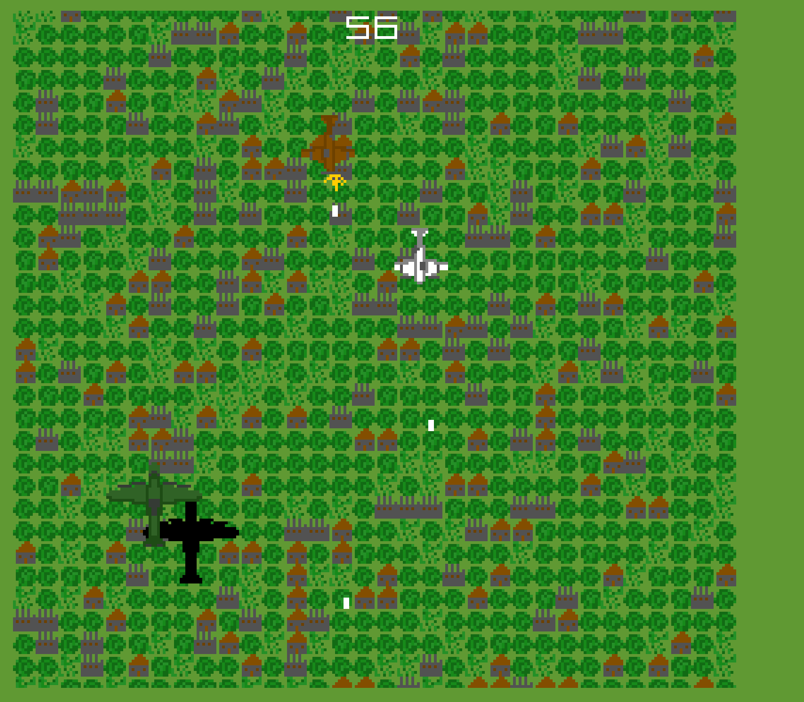

# Overhead!

Author: Thomas Carey

Design: All game assets are derived from 2 large tilemaps which can be swapped out at will. The game automatically derives pallettes from the tilemap, and can build large animated groups of sprites.

Screen Shot:

How Your Asset Pipeline Works:

All assets are pulled from one large spritesheet. Pallettes are derived directly from that spritesheet - the system automatically finds pallettes which are subsets of one another and combines them to minimize total pallette count. 

I can also use the SpriteGroup class I made to group sets of sprites together with a given anchor point. I add an offset to the tile index of the SpriteGroup to add an offset to the tile indexes of each sprite in the group. Since the tiles are added in the same order as they appear in the spritesheet, with the offsets I can easily make and switch between animation states. 

How To Play:

Menu:

WASD to fly in a particular direction, SPACE to shoot.
Survive the timer to win.

This game was built with [NEST](NEST.md).

